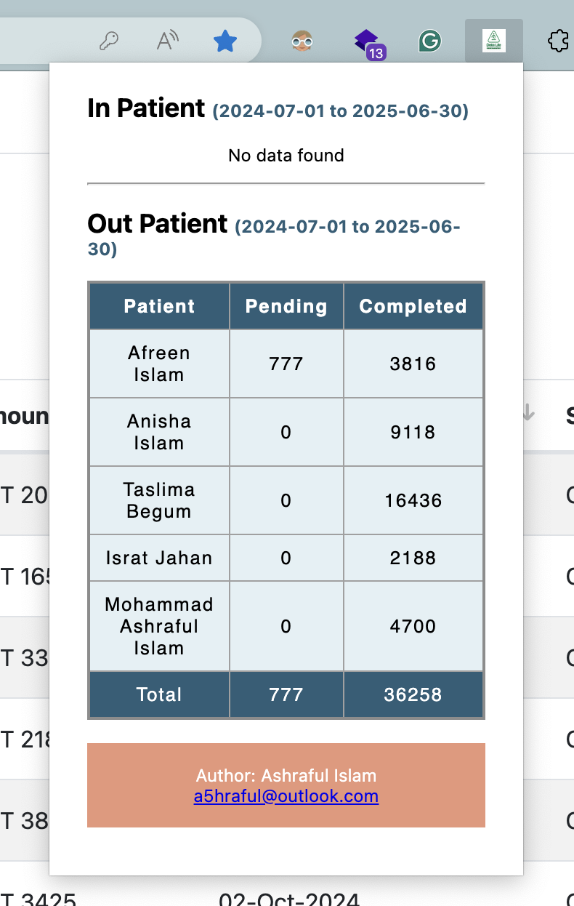

# Dashboard for Delta Life Insurance

This repository contains a dashboard extension designed for Delta Life Insurance, providing a seamless way to visualize and manage insurance-related data effectively. This tool enables users to interact with insurance metrics, analyze trends, and optimize workflows through a user-friendly interface.

## How to install?

Download from github release. Drag and drop to the browser extentions.

## Demo

